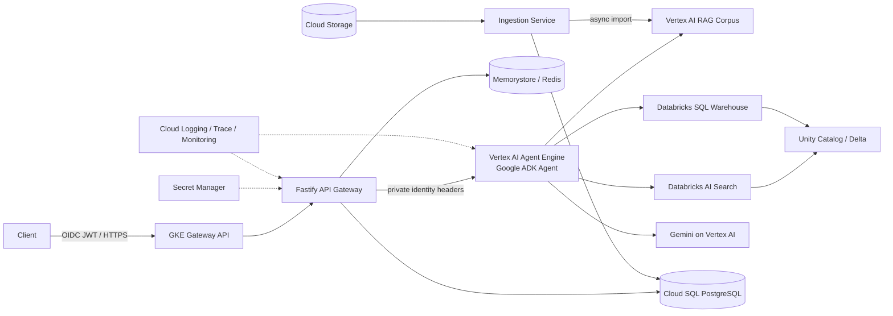

# Agentic RAG Platform

Production-oriented, multi-tenant semantic RAG built with TypeScript, Fastify, Google ADK, Vertex AI Agent Engine, Databricks SQL and AI Search, optional Vertex AI RAG, PostgreSQL/Prisma, Redis, GKE Gateway API, Terraform, and GitLab CI/CD.

> “Google AX” is implemented here as Google **ADK + Vertex AI Agent Engine**. The code targets `@google/adk` 2.1.x. No credentials are committed.

## Architecture



The gateway is the policy enforcement point. It validates JWTs, derives tenant identity from signed claims (never request bodies), rate-limits, applies input guardrails, and uses tenant-scoped cache keys. The ADK agent uses the native `VertexRagRetrievalTool` and `VertexAiRagMemoryService`, a citation-first prompt, and treats retrieval output as untrusted data. Ingestion is isolated from request serving so document parsing and indexing can scale independently.

## Repository layout

```text
apps/
  gateway/       public Fastify API and policy enforcement
  agent/         Google ADK root agent and Agent Engine deployment unit
  ingestion/     asynchronous document ingestion control plane
packages/
  cache/         Redis cache abstraction and tenant-safe keys
  config/        fail-fast validated runtime configuration
  contracts/     Zod API contracts
  database/      Prisma schema/client for durable metadata and history
  security/      JWT verification, logging redaction, prompt-injection checks
  databricks/    OAuth M2M, AI Search, and allowlisted parameterized SQL
infra/
  k8s/           GKE Gateway API, queue-driven KEDA jobs, PDB, NetworkPolicy, ExternalSecret
  terraform/     project, APIs, Artifact Registry, Autopilot GKE, Workload Identity
docs/            architecture, security, operations, and deployment guides
```

## Local setup

Requirements: Node.js 22, Docker, Application Default Credentials, and access to a Vertex AI project.

```bash
cp .env.example .env
docker compose up -d
npm ci
npm run prisma:generate
npm run prisma:migrate
npm run check
npm run dev
```

Set `GOOGLE_GENAI_USE_VERTEXAI=true`, `GOOGLE_CLOUD_PROJECT`, and `GOOGLE_CLOUD_LOCATION`. Run the ADK developer UI with `npm run adk:web -w @app/agent`.

## Google Cloud deployment

1. Create/select a billing account and choose a globally unique project ID.
2. Apply Terraform (see [deployment guide](docs/deployment.md)).
3. Create a Vertex AI RAG corpus per security boundary and put its resource name in Secret Manager. Do not mix tenants in a corpus unless every retrieval call enforces metadata ACL filters.
4. Deploy the exported `rootAgent` to Agent Engine with the ADK CLI.
5. Build/push the service image, apply the Kustomize overlay, configure DNS and a certificate.

Agent Engine is the managed Google ADK runtime and scales independently. GKE keeps three gateway replicas for synchronous traffic; ingestion is queue-driven through Pub/Sub and KEDA `ScaledJob`, creating short-lived worker Pods per backlog without an application HPA.

## API

`POST /v1/chat` accepts:

```json
{"message": "What does the onboarding policy say?", "sessionId": "optional-uuid"}
```

Authentication is an RS256 OIDC bearer JWT with `sub`, `tenant_id`, and optional `roles` claims. Production should use Identity Platform, IAP, or your enterprise IdP and private service-to-service authentication between GKE and Agent Engine.

## Production readiness checklist

- Replace placeholder hostnames, project IDs, and image names.
- Provision Cloud SQL HA and Memorystore with private IP; their modules are intentionally environment-specific.
- Configure Secret Manager and External Secrets Operator; do not create Kubernetes plaintext secrets.
- Add VPC Service Controls/Private Service Connect where compliance requires it.
- Add domain-specific eval sets, golden answers, and red-team cases before promotion.
- Configure alert policies for p95 latency, 5xx, safety rejection rate, cache health, token usage, and RAG grounding quality.
- Use GitLab Workload Identity Federation; never store service-account JSON keys.

See [architecture](docs/architecture.md), [Databricks HLD](docs/hld-databricks.md), [Databricks LLD](docs/lld-databricks.md), [security](docs/security.md), [memory and cache](docs/memory-cache.md), and [operations](docs/operations.md).

## License

Apache-2.0. See [LICENSE](LICENSE).
