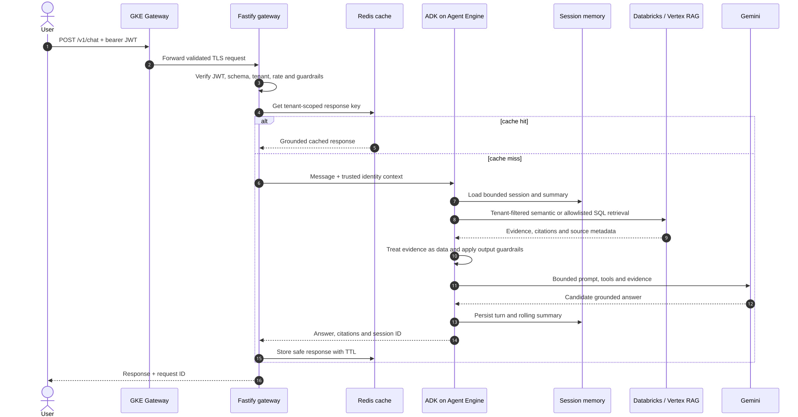

# Production Agentic RAG Platform

A production-oriented, multi-tenant semantic RAG reference platform using TypeScript, Fastify, Google ADK, Google AX, Vertex AI Agent Engine, Databricks, BullMQ, Redis, PostgreSQL, GKE Gateway API, Terraform, and GitLab CI/CD.

Google ADK and Google AX serve different purposes:

- **ADK on Agent Engine** serves synchronous customer RAG requests.
- **Google AX** runs isolated autonomous audits and evaluations outside the serving path.
- **BullMQ with KEDA `ScaledJob`** scales ingestion workers from queue depth. Application HPA is not used.

> Google AX is currently `v1alpha1`. This repository pins its upstream revision and task-runner digest. No credentials are committed.

## Solution at a glance

| Concern              | Design choice                                                |
| -------------------- | ------------------------------------------------------------ |
| Public API           | Fastify behind GKE Gateway API with OIDC/JWT enforcement     |
| Agent runtime        | Google ADK deployed to Vertex AI Agent Engine                |
| Autonomous workloads | Google AX + Agent Substrate, sandboxed and isolated          |
| Semantic retrieval   | Databricks AI Search, Vertex AI RAG, or hybrid mode          |
| Structured retrieval | Parameterized, allowlisted Databricks SQL views              |
| Async processing     | BullMQ on dedicated Redis + KEDA `ScaledJob`                 |
| Memory               | Bounded working context, durable sessions, rolling summaries |
| Cache                | Tenant-scoped Redis keys with TTL and safe invalidation      |
| Persistence          | PostgreSQL/Prisma for metadata and durable history           |
| Platform             | GKE, Artifact Registry, Secret Manager, Workload Identity    |
| Delivery             | GitLab CI/CD, Kaniko, Trivy, Terraform, Kustomize            |

## High-level design



The solution has three independently scalable planes:

1. **Online serving:** Gateway → Fastify policy layer → ADK/Agent Engine → governed retrieval → Gemini.
2. **Ingestion:** uploads create BullMQ jobs; KEDA creates short-lived workers directly from backlog depth.
3. **Autonomy:** Google AX runs bounded audit/evaluation actors without online production credentials.

This separation keeps AX or ingestion failures from interrupting customer chat traffic.

## Low-level request flow



Tenant identity is derived only from verified JWT claims. Every cache, memory, SQL, and vector-search operation carries that trusted tenant boundary. Retrieved text is treated as untrusted data rather than agent instructions.

## End-to-end flows

### Query path

1. GKE Gateway terminates TLS and routes `/v1/chat` to Fastify.
2. Fastify verifies the JWT, validates the body, derives `tenant_id`, rate-limits, and runs input guardrails.
3. A tenant-scoped Redis cache is checked.
4. ADK loads bounded session memory and selects only allowlisted retrieval tools.
5. Databricks AI Search or Vertex RAG applies mandatory tenant filters; Databricks SQL uses parameterized allowlisted views.
6. Gemini produces a citation-first answer from bounded evidence.
7. Output guardrails run, memory is persisted, and a safe response is cached with a TTL.

### Ingestion path

1. A document lands in an allowlisted Cloud Storage location.
2. The producer creates an idempotent BullMQ job.
3. KEDA observes `bull:ingestion:wait` and creates a one-shot worker Job—no application HPA.
4. The worker validates type/size, performs security inspection, computes a checksum, and writes to the selected retrieval backend.
5. Durable status is updated and related tenant cache namespaces are invalidated using `SCAN` + `UNLINK`.

### Google AX path

1. GitLab builds and scans the digest-pinned AX task-runner image.
2. AX resolves the declared `Workspace`, `Model`, and `Task` in the `agentic-rag` atespace.
3. Agent Substrate launches a resource-bounded ephemeral actor with `debug: false`.
4. The actor clones the approved repository, runs validation/audit work, and emits logs/results.
5. AX actors have no deployment identity, Databricks token, or online Agent Engine service-account access.

## Security and guardrails

- RS256 OIDC authentication; tenant identity never comes from request bodies.
- Prompt-injection checks on input and retrieved content; retrieved text cannot redefine system policy.
- Narrow ADK tools with Zod schemas, timeouts, result limits, and no arbitrary SQL or shell execution.
- Defense in depth through application tenant filters and Unity Catalog ABAC, row filters, masks, and grants.
- Separate Redis instances: evicting response cache and `noeviction` BullMQ queue storage.
- Secret Manager + Workload Identity Federation; no service-account keys in GitLab variables.
- AX actors are sandboxed, resource-limited, non-debuggable in production, and isolated from the serving plane.
- CI runs formatting, lint, type checks, tests, AX validation, secret scanning, and container vulnerability scans.

See [security controls](docs/security.md) and [memory/cache design](docs/memory-cache.md).

## Repository structure

```text
apps/
  agent/          Google ADK agent and Agent Engine deployment unit
  gateway/        Fastify public API and policy enforcement point
  ingestion/      BullMQ producer and one-shot queue worker
packages/
  cache/          tenant-safe cache abstraction and key strategy
  config/         fail-fast validated configuration
  contracts/      shared Zod API contracts
  database/       Prisma schema and durable persistence
  databricks/     OAuth, AI Search, and safe SQL adapter
  security/       JWT, redaction, and prompt-injection guardrails
infra/
  ax/             Google AX Workspace, Model, Task, and version pin
  k8s/            Gateway API, KEDA jobs, policies, and ExternalSecret
  terraform/      GCP APIs, Artifact Registry, GKE, and identities
docs/
  diagrams/       rendered HLD/LLD images and Mermaid sources
  *.md            architecture, security, operations, and deployment
```

## Quick start

Prerequisites: Node.js 22.20+, Docker, PostgreSQL, Redis, Application Default Credentials, and a Vertex AI-enabled GCP project.

```bash
cp .env.example .env
docker compose up -d
npm ci
npm run prisma:generate
npm run prisma:migrate
npm run check
npm run dev
```

Set `GOOGLE_GENAI_USE_VERTEXAI=true`, `GOOGLE_CLOUD_PROJECT`, and `GOOGLE_CLOUD_LOCATION`. For Databricks, select `RETRIEVAL_BACKEND=databricks` or `hybrid` and configure OAuth M2M values from Secret Manager.

Developer commands:

```bash
npm run dev                         # Fastify gateway
npm run adk:web -w @app/agent      # ADK developer UI
npm run ax:validate                 # Validate AX resource contract
npm run check                       # Complete local quality gate
```

## API

`POST /v1/chat`

```json
{
  "message": "What does the onboarding policy say?",
  "sessionId": "optional-uuid"
}
```

The request requires an RS256 bearer token containing `sub`, `tenant_id`, and optional `roles` claims. Responses include the grounded answer, citations, session identifier, and request correlation metadata.

## Deployment overview

1. Choose a billing-enabled GCP project and globally unique project ID.
2. Configure GitLab Workload Identity Federation and protected environment variables.
3. Apply Terraform from `infra/terraform`.
4. Provision private Cloud SQL and separate Memorystore instances for cache and BullMQ.
5. Configure Secret Manager and External Secrets Operator.
6. Create tenant-isolated Vertex RAG corpora and/or governed Databricks indexes/views.
7. Deploy `rootAgent` to Vertex AI Agent Engine.
8. Build and scan application and AX images; apply the production Kustomize overlay.
9. Install the pinned Google AX control plane and Agent Substrate, then apply `infra/ax/resources.yaml`.
10. Configure DNS, managed certificates, dashboards, alerts, backup/restore tests, and evaluation gates.

Exact commands and required variables are in the [deployment guide](docs/deployment.md). AX installation and rollback are in the [Google AX design](docs/google-ax.md).

## Design documentation

| Document                                 | Scope                                                |
| ---------------------------------------- | ---------------------------------------------------- |
| [Architecture](docs/architecture.md)     | Request lifecycle and platform principles            |
| [Google AX HLD/LLD](docs/google-ax.md)   | AX resource model, isolation, deployment, rollback   |
| [Databricks HLD](docs/hld-databricks.md) | Governed retrieval boundaries and scale model        |
| [Databricks LLD](docs/lld-databricks.md) | API calls, safe SQL compiler, failure behavior       |
| [Memory and cache](docs/memory-cache.md) | Context, summaries, Redis keys, TTL and invalidation |
| [Security](docs/security.md)             | Threat controls, guardrails, tenancy, secrets        |
| [Operations](docs/operations.md)         | SLOs, alerts, failure recovery and runbooks          |
| [Deployment](docs/deployment.md)         | GCP, GKE, Agent Engine and CI/CD setup               |

## Production readiness

The repository provides production patterns, but deployment is environment-specific. Before going live:

- replace every image, hostname, project, corpus, index, and secret placeholder;
- use private networking, VPC Service Controls/PSC where required, and restricted egress;
- configure HA, backups, PITR, queue persistence, retention, quotas, budgets, and disaster recovery;
- validate tenant isolation with cross-tenant canaries and red-team prompt-injection suites;
- enforce immutable images, Binary Authorization, protected releases, and manual production approval;
- define SLOs for latency, availability, grounding, safety rejection, backlog age, and token/cost usage.

## License

Apache-2.0. See [LICENSE](LICENSE).
