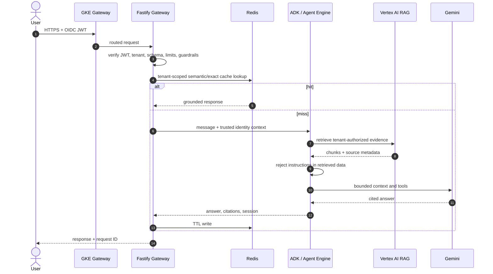

# Architecture and request lifecycle

## Online query sequence

## Design principles

- Hexagonal boundaries: HTTP, Redis, Prisma, and Vertex integrations sit behind small interfaces.
- Dependency inversion: domain contracts do not import infrastructure packages.
- Stateless compute: pods hold no authoritative session state and can scale horizontally.
- Tenant isolation: tenant identity comes exclusively from verified JWT claims and is embedded in every persistence/cache/retrieval key.
- Bounded agent autonomy: allowlisted tools, explicit schemas, max input/body/time budgets, and no arbitrary code execution.
- Governed lakehouse access: Databricks structured tools compile only allowlisted parameterized view reads; semantic tools enforce tenant metadata filters.
- At-least-once ingestion: document upsert keys make retries idempotent; workers should publish status transitions transactionally.
- Queue-driven Pods: Pub/Sub backlog creates one-shot KEDA jobs that pull, process, acknowledge, and exit; the gateway is not coupled to ingestion concurrency.

## Retrieval pipeline

Documents arrive only from allowlisted `gs://` locations. A production worker validates MIME type and size, performs malware/DLP inspection, computes a checksum, imports to a tenant corpus, and atomically marks the document ready. Queries apply tenant metadata filters before vector search. Reranking and a minimum relevance threshold prevent low-confidence chunks from reaching the model.
