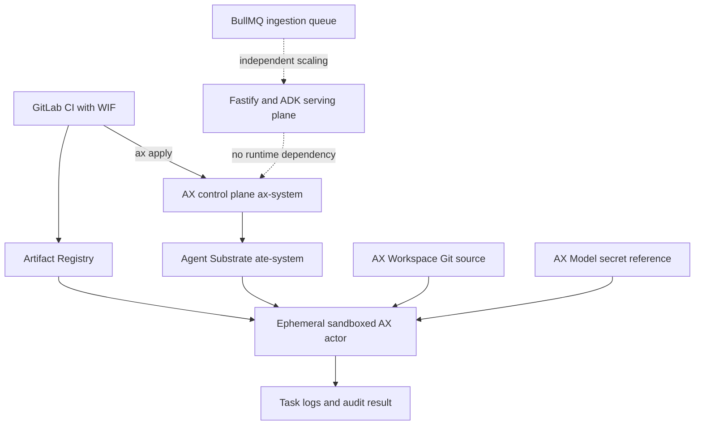

# Google AX integration

This repository uses the actual [Google AX](https://github.com/google/ax) runtime for isolated, asynchronous autonomous engineering and evaluation tasks. It does not rename Google ADK as AX. Google ADK on Vertex AI Agent Engine remains the online RAG runtime; BullMQ and KEDA remain the ingestion work queue.

AX is currently `v1alpha1`. This integration is isolated from the serving path and pinned to upstream commit `d0bc38bcf90bb2ad9c012ff1be9d68ff05347ba9`. Review upstream release notes and the runner contract before changing that pin.

## HLD



An AX outage cannot break customer chat traffic, and autonomous actors receive no production deployment credentials. AX actors are short-lived, resource-bounded, and run with `debug: false`.

## LLD and resource contract

`infra/ax/resources.yaml` declares one `atespace` containing:

- `Workspace`: clones only this repository's `main` branch into `/workspace` and supplies the bounded task goal.
- `Model`: references `ax-gemini-credentials/GEMINI_API_KEY`; the value is never stored in Git.
- `Task`: uses the hardened AX runner image, fixed CPU/memory limits, a deterministic validation command, and no debug/SSH guest service.

`Dockerfile.ax` extends Google's digest-pinned task runner and adds only the pinned Node.js toolchain. AX must retain `/usr/local/bin/ax-task-runner`; do not replace the image entrypoint. The workspace is injected at runtime, so source and credentials are not baked into the image.

## Install on GKE

AX requires Agent Substrate and its control plane. Installation is cluster-administrator work and is separate from application Kustomize because AX is alpha cluster infrastructure.

```bash
git clone https://github.com/google/ax.git
cd ax
git checkout d0bc38bcf90bb2ad9c012ff1be9d68ff05347ba9
# Follow this revision's Agent Substrate prerequisites, then:
make deploy AX_IMAGE_REPO=REGION-docker.pkg.dev/PROJECT_ID/platform/ax
go install github.com/google/ax/cmd/ax@d0bc38bcf90bb2ad9c012ff1be9d68ff05347ba9
```

Create `ax-gemini-credentials` in the namespace expected by the pinned AX deployment using Secret Manager/External Secrets or a CI-provided value. Never pass it on a command line or commit it. Prefer Workload Identity when the selected AX provider version supports it.

Build and apply:

```bash
docker build -f Dockerfile.ax -t REGION-docker.pkg.dev/PROJECT_ID/platform/ax-task-runner:RELEASE_SHA .
docker push REGION-docker.pkg.dev/PROJECT_ID/platform/ax-task-runner:RELEASE_SHA
sed 's|REGION-docker.pkg.dev/PROJECT_ID/platform/ax-task-runner:RELEASE_SHA|YOUR_IMMUTABLE_IMAGE|g' infra/ax/resources.yaml > /tmp/ax-resources.yaml
ax apply -f /tmp/ax-resources.yaml
ax get tasks --atespace agentic-rag
```

Production promotion must use an immutable image digest. The placeholder intentionally prevents an accidental deployment from this source manifest.

## Security and operations

- Put AX in a dedicated GKE cluster or node pool for strong isolation; apply organization policy, NetworkPolicy, egress allowlists, Binary Authorization, and image vulnerability gates.
- Grant actors read-only source access and only task-specific APIs. Never attach the deployer or online Agent Engine service account.
- Keep `debug: false`; enable it only in a separate non-production atespace with expiry and audit trail.
- Treat repository text, Databricks rows, MCP output, and retrieved documents as untrusted instructions. Do not expose Databricks tokens to this audit task.
- Export AX, actor, and Kubernetes audit logs to Cloud Logging; alert on failed/suspended tasks, unexpected egress, resource exhaustion, and secret access.
- Cap concurrency with AX/Substrate quotas. BullMQ backlog scaling stays controlled by KEDA `ScaledJob`, not HPA and not AX.

Rollback means stop new submissions, suspend/delete the affected task through the pinned CLI, and redeploy the last approved image. This does not roll back the online API.
