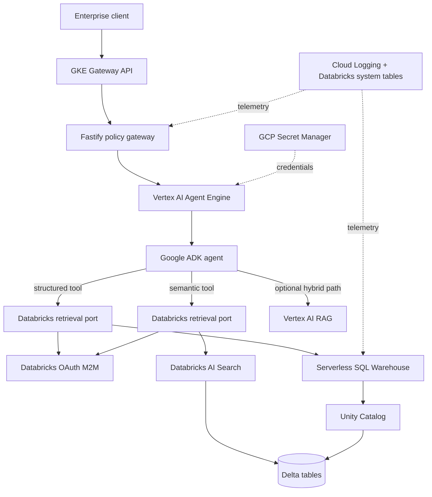
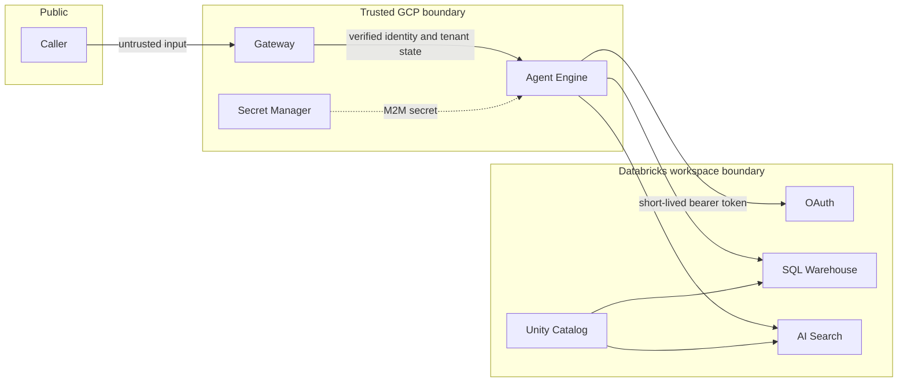

# High-level design: Databricks governed retrieval

## Purpose

This design lets the Google ADK agent answer from governed Databricks data without exporting the lakehouse into another vector database. Vertex AI RAG remains optional for document collections that already live in GCP.

## System context

## Responsibilities

| Component         | Responsibility                                                                     |
| ----------------- | ---------------------------------------------------------------------------------- |
| Gateway           | OIDC authentication, trusted tenant derivation, rate limits, input guardrails      |
| Agent Engine      | Managed ADK execution, model calls, session lifecycle, traces                      |
| ADK tools         | Expose narrow semantic and structured capabilities; never arbitrary SQL            |
| Retrieval adapter | OAuth token caching, tenant predicates, allowlists, quotas, response normalization |
| SQL Warehouse     | Execute bounded parameterized reads against governed views                         |
| AI Search         | Hybrid semantic retrieval with mandatory `tenant_id` metadata filter               |
| Unity Catalog     | Grants, ABAC/row filters, column masks, lineage, audit controls                    |

## Deployment modes

- `vertex`: native Vertex RAG only.
- `databricks`: Databricks AI Search and governed SQL only.
- `hybrid`: Databricks for live lakehouse data plus Vertex RAG for approved GCP documents.

## Trust boundaries

Defense in depth requires both application tenant predicates and Unity Catalog policies. An application filter is not a replacement for row filters, column masks, or ABAC.

## Scale and availability

The services are stateless. OAuth tokens are cached per process until one minute before expiry. Agent Engine and the SQL warehouse scale independently. AI Search serves semantic traffic separately from analytical SQL. Set explicit Databricks warehouse concurrency, autoscaling, and spend policies; apply gateway and tenant quotas to prevent noisy-neighbor and denial-of-wallet incidents.

## Key decisions

1. REST APIs are used instead of JDBC/Thrift to keep the runtime lightweight and compatible with Agent Engine.
2. Semantic search sends `query_text`; Databricks manages the embedding model associated with the Delta Sync index.
3. The model chooses a tool but never controls credentials, tenant identity, SQL syntax, warehouse IDs, or index names.
4. SQL reads only pre-approved three-part Unity Catalog views. Views are designed as agent-facing contracts and carry a `tenant_id` column.
5. Result limits and timeouts are enforced both by the adapter and Databricks Statement Execution API.
