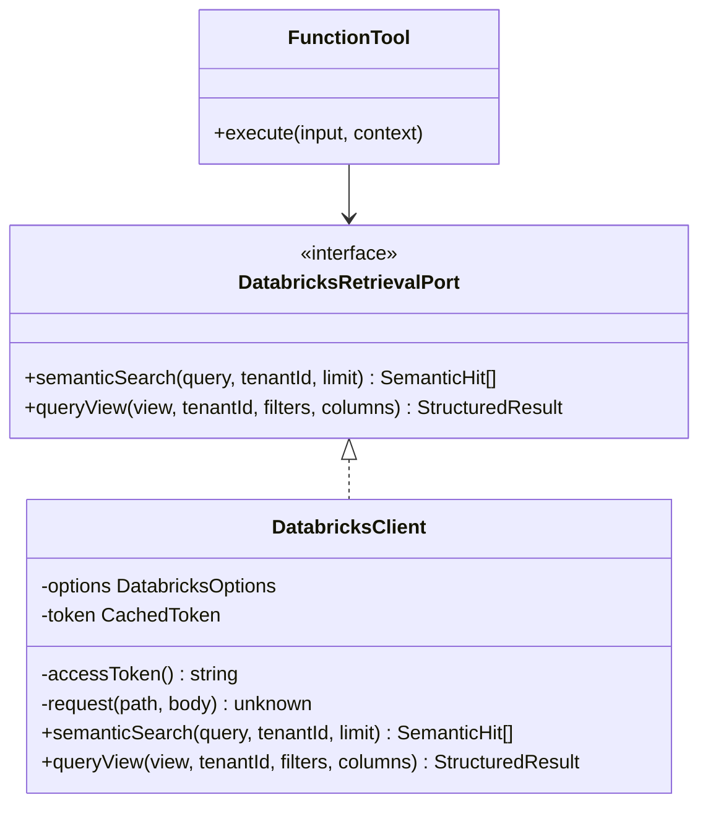
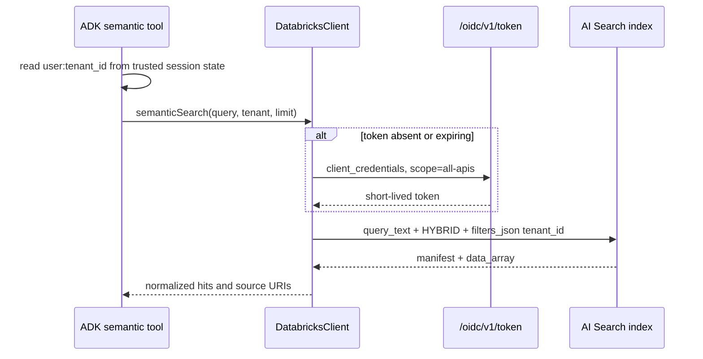

# Low-level design: Databricks integration

## Modules

`@platform/databricks` defines the `DatabricksRetrievalPort` and its REST implementation. The constructor validates the configured index, projected vector columns, and view allowlist before serving traffic.



## Semantic sequence



## Structured-query compiler

The tool accepts `view`, `columns`, and equality `filters`. Compilation follows these invariants:

1. `view` must exactly match `DATABRICKS_ALLOWED_VIEWS` and conform to a three-part identifier.
2. Columns and filter names must match a strict identifier grammar.
3. `tenant_id = :tenant_id` is always the first predicate; callers cannot override it.
4. Values become named Statement Execution API parameters and never enter SQL text.
5. Only `SELECT` is generated. No joins, expressions, subqueries, comments, functions, DDL, or DML are accepted.
6. Databricks applies `row_limit`, `byte_limit`, a 15-second wait, and cancel-on-timeout.

Example generated statement:

```sql
SELECT `customer_id`, `status`
FROM `main`.`agent`.`customer_summary`
WHERE tenant_id = :tenant_id AND `region` = :filter_0
```

## Configuration

| Variable                      | Purpose                             | Secret     |
| ----------------------------- | ----------------------------------- | ---------- |
| `RETRIEVAL_BACKEND`           | `vertex`, `databricks`, or `hybrid` | No         |
| `DATABRICKS_HOST`             | Workspace HTTPS origin              | No         |
| `DATABRICKS_CLIENT_ID`        | OAuth service-principal ID          | Usually no |
| `DATABRICKS_CLIENT_SECRET`    | OAuth M2M secret                    | Yes        |
| `DATABRICKS_SQL_WAREHOUSE_ID` | Read-only SQL warehouse             | No         |
| `DATABRICKS_VECTOR_INDEX`     | Three-part AI Search index          | No         |
| `DATABRICKS_VECTOR_COLUMNS`   | Returned index metadata columns     | No         |
| `DATABRICKS_ALLOWED_VIEWS`    | Comma-separated agent-facing views  | No         |

Store the secret in GCP Secret Manager and expose it only to the Agent Engine identity. Rotate it and redeploy before expiration.

## Unity Catalog setup

Create an `agent` schema containing narrow views. Grant the service principal `USE CATALOG`, `USE SCHEMA`, and `SELECT` only on those views and the source table permission required for AI Search. Apply ABAC policies or row filters and column masks to the underlying data. The view must include `tenant_id` for application enforcement but should omit unnecessary PII entirely.

```sql
CREATE VIEW main.agent.customer_summary AS
SELECT tenant_id, customer_id, status, region, updated_at
FROM main.curated.customers;

GRANT USE CATALOG ON CATALOG main TO `agent-service-principal`;
GRANT USE SCHEMA ON SCHEMA main.agent TO `agent-service-principal`;
GRANT SELECT ON VIEW main.agent.customer_summary TO `agent-service-principal`;
```

## Failure behavior

- OAuth or API errors expose only status categories, never response bodies or credentials.
- Non-allowlisted views and unsafe identifiers fail closed.
- Non-successful SQL states fail rather than returning partial data.
- Truncated successful responses carry `truncated=true`; the agent must disclose incompleteness.
- Timeout cancellation avoids orphaned expensive statements.

## Verification

Unit tests assert token reuse, mandatory vector tenant filters, mandatory parameterized SQL tenant predicates, and rejection of unsafe/non-allowlisted identifiers. Integration tests should run against a non-production workspace with two tenants and prove cross-tenant canary values are never returned.
